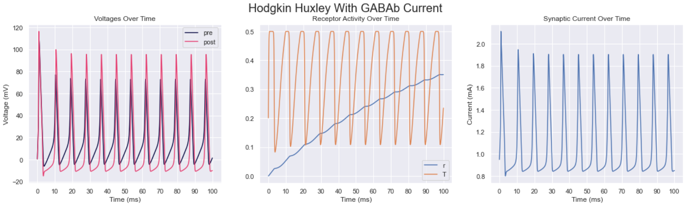

# Spiking Neural Networks

Generalized spiking neural network system with various intergrate and fire models as well as Hodgkin Huxley models,
EEG processing with fourier transforms, and power spectral density calculations

## Biological Neuron Models Broken Down

- (todo...)
- (explanation of integrate and fire)
- (explanation of izhikevich)
- (explaination of hodgkin huxley)
- (explanation of ion channels)
- (explanation of neurotransmission, how hodgkin hux system is adapted for izhikevich, explain why receptor kinetics are fixed)

## Notes

- To fit Izhikevich neuron to Hodgkin Huxley model, can either:
  - Fit voltage changes in Izhikevich to voltage changes in Hodgkin Huxley
  - Fit Izhikevich curve to Hodgkin Huxley
    - Can either use a Fourier transform to compare or use mean squared error at each iteration
    - Or, compare the difference between spike times and the amplitude of the spikes (spike time difference being post minus pre, could compare individual spike differences or average spike difference)
      - Write trait for iterate function so coupled neuron firing code can be shared between Hodgkin Huxley and Izhikevich neurons
      - Cell might need a rename to IntegrateAndFireModel
      - Perform this for multiple static inputs, 0 to 100
      - Or perform this with coupled neurons (might need to account for weights)
      - Or both at the same time
    - Fitting bursting Izhikevich to bursting Hodgkin Huxley
      - Need way to detect bursts for Izhikevich fitting, probably something that has a burst tolerance (distance between spikes that differentiates either part of a burst group or the next set of bursts firing)
      - Then comparing the distance between burst groups and the intervals of the burst groups
- Can also implement version that either adds neurotransmitter current or adds the current to stimulus

- Eventually remove old neurotransmitter system and replace it with new one
- Eventually remove existing genetic algorithm fit for matching an EEG signal and replace it with R-STDP one or at least genetic algorithm that changes weights rather that input equation

- Add neurotransmitter output to each presynaptic neuron that calculates concentration with its own membrane potential, then have postsynaptic neurons sum the concentration * weight to calculate their neurotransmitters
- Separate receptor kinetics struct, dependent on $t_total$
  - Receptor kinetics input (of weighted neurotransmitter concentration) should only be calculated if receptor kinetics is not static
    - **Receptor kinetics handling should have an inputtable value to set r at**
  - Neurotransmitter and receptor kinetics structs should be stored in different hashmaps that relate an enum (specifying the type, basic, AMPA, NMDA, GABAa, GABAb) to the struct (the struct would then have the appriopriate parameters associated with that enum)
    - `HashMap<NeurotransmitterType, Neurotransmitter>`, `HashMap<NeurotrnasmitterType, ReceptorKinetics>`
- Neurotransmitter current should be calculated after $dv$ and $dw$ are calculated and applied when those respective changes are applied, `iterate_and_spike` function should be modified to take in an addition change in voltage which can be applied with the $dv$ calculation so it can be added before the spike is handled
  - ie add argument to `iterate_and_spike` which is an `Option<f64>` called `additional_dv` that adds the $dv$ change calculated by the neurotransmitter current after neurotransmitter currents are set and returned
    - Get presynaptic neurotransmitter concentrate
    - Calculate $dv$ change from neurotransmitter current
    - Add it to the voltage in the `iterate_and_spike` function
  - Old update neurotransmitter function should be removed in favor of this

- Add $\tau_m$ and $C_m$ to fitting parameters

- **Hodgkin Huxley should implement `iterate_and_spike` function** (could be done after neurotransmitter refactor)
  - Spike should return true when it is above a certain threshold and it has stopped increasing
    - Should have a `last_firing_time` field and a `is_increasing` field as well as a `v_th` field
    - Might need a NeurotransmitterAndReceptor trait
      - Trait ensures that the struct has neurotransmitters
      - Ensures that there are receptor kinetics structs as well
      - Ensures that it has functionality to update both the kinetics and neurotransmitter concentration

- **Move non initialization parameters from IFParameters to cell struct**
  - Make function to translate IFParameters and STDPParameters to cell struct
  - Have a set of bayesian parameters for ensemble of neurons to use
    - Have separate function to get those parameters from TOML
    - Bayesian should only be used with standard deviation is not 0 (for all functions)
- **Completely remove IFParameters**
  - Repurpose get_if_params function to get IFCell parameters
    - Standardize creation of IFCell and have `test_coupled_neurons` function and `test_isolated_stdp` function take in the neurons as parameters rather than generating them from inside the function
      - Standard creation in the same way Hodgkin Huxley model is generated
  - Consider removing 0-1 scaling default
  - Make sure to use regular parameters default if IFType is not Izhikevich or Izhikevich Leaky, but if it is use the Izhikevich default
  - Update code in obsidian when refactor is done, maybe update results
- Seperate STDP parameters into STDP parameters and weight initialization parameters
  - Obsidian notes on STDP equations

- **Get coupled neuron test to work with IterateAndSpike trait**
  - Get it to work with Hodgkin Huxley model with IterateAndSpike trait
  - Can ignore neurotransmission for now
    - Iterate and spike trait could be modified to take in a `Option<f64>` for additional $dv$ changes where the additional change in voltage is the neurotransmission current

- Change `BufWriter` capacity from 8 kb to 4 mb or 8 mb and see if its faster (use `with_capacity` function)

- Weighted neuron input should be the only input function

- Have system to generate new neurotransmitter and receptors from TOML

- Split `main.rs` functions into a few different files for readability

- Eventually split up integrate and fire types into seperate structs, use macros to share code between structs

- FitzHugh–Nagumo model (FHN)

- Should create a CellType enum to store IFType and Hodgkin Huxley type for later use in lattice simulation function

- Use Rayon to thread lattice calculations (remove storing dv and is_spiking in hashmap and place it in the struct)
  - Inputs should be calculated in parallel
    - There should be a GraphFunctionalitySynced trait for the lookup weight function, get incoming connections, get outgoing connections, and get every node function, the rest can be under the regular GraphFunctionality trait, the weighted input function should have a `&dyn GraphFunctionalitySynced` argument
      - Could replace `&dyn GraphFuntionality` with a generic and a trait
      - Maybe graph should be in an `Arc<Mutex<T>>`, unlocked to edit weights, would need to be able to pass locked version to get weights without unlocking Mutex
  <!-- - Build function to allow Arc mutex access of cell grid, it first calculates dv and dw and spike and then unlocks Mutex to modify neuron, function should return another function that does this for the appropriate integrate and fire type -->
  <!-- - Calculations could be chunked (a section of neurons to operate on instead of just one at a time)
    - Weight changes do not need to be parallelized immediately if many spikes do not occur at once -->
  - Cells could be modified with `par_iter_mut` or a `par_chunk_mut`, this part would need to be benchmarked but could modify weights but not in parallel and see if the parallel implemenation is still faster since a majority of the calculation is threaded
    - Or could parallelize editing of weights by using `par_iter_mut` to calculate the weights and then applying them
  - Parallel functionality should also be benchmarked

- EEG testing
  - Determine frequency band of EEG values over 30 seconds (could calculate frequencies seperately in Python with Numpy for now)
  - Leave room for convergence (about 500 steps with $dt=0.1$)
    - Should expect beta or gamma frequencies above 10 hz and below 50 hz

- Lixirnet should be reworked after neurotransmission refactor, should just pull from backend
  - Update by copying over backend
  - Use macros to generate getter and setter methods given the argument name
    - For integrate and fire cell and Hodgkin Huxley model
    - **Enable multiple-pymethods so the macro can be written**
    - [Reference for macro](https://github.com/PyO3/pyo3/discussions/3628)
  - For now Lixirnet can work with lattices by converting adjacency matrices in Numpy to Rust
  - Should have an option to convert the matrix to and adjacency list later, or implement a direct conversion from dictionary to adjacency list

- Should also be adapted for a cargo package

- Input from cell grid functions should be refactored to work with Hodgkin Huxley cells via a trait and condensed into one function where weighting is optional

- Hopfield network
  - [Hopfield network pseudocode](https://www.geeksforgeeks.org/hopfield-neural-network/)
  - [Hopfield network tutorial](https://github.com/ImagineOrange/Hopfield-Network/blob/main/hopfield_MNIST.py)
  - [Hopfield network explained](https://towardsdatascience.com/hopfield-networks-neural-memory-machines-4c94be821073)
  - Hopfield network needs its own graph representation, should extend graph trait, some of graph trait could be split up so graph used in lattice simulation has functionality for STDP weights while Hopfield static weights don't change, graph trait could also be refactored so min, max, mean, and std can be passed in rather than STDP parameters
- When done with Hopfield, move to the [cue model](https://onlinelibrary.wiley.com/doi/full/10.1111/tops.12247#:~:text=Guanfacine%20increases%20(Yohimbine%20decreases)%20the,effect%20on%20nonpreferred%20direction%20neurons.)
  - Cue input is fed into working memory neurons
    - Cue is -1 or 1
  - Working memory neurons loop back into themselves with some bayesian noise
  - Cue is removed and working memory output can be decoded
    - Decoded by taking weighted sum of working memory neurons
    - If below 0, then percieved cue is -1, if above 0, percieved cue is 1
    - **Or perceived cue could be above or below a given baseline, cue itself can be a fast (or excitatory) spike train or a slow (or potentially inhibitory) spike train, 0 is a baseline spike train speed (spike train just being a series of spikes)**
      - Poisson neuron should be used to generate spike train
      - Might be more practical to use an excitatory and inhibitory input and check deviation from baseline over time
  - Firing rate of neurons increase over time signal should become more unstable over time and starts to not represent the same signal
  - To also model forgetting, increasing amounts of noise can be added to working memory model over time
- When done with cue models, move to [liquid state machines](https://medium.com/@noraveshfarshad/reservoir-computing-model-of-prefrontal-cortex-4cf0629a8eff#:~:text=In%20a%20reservoir%20computing%20model,as%20visual%20or%20auditory%20cues.) (also accessible [here](https://journals.plos.org/ploscompbiol/article?id=10.1371/journal.pcbi.1006624))
  - Recurrent connections in reservoir compute act as working memory that stores information through recurrent connections that may slowly degrade over time, target is slowing the degradation in order to improve memory recall
  - Decoding unit acts as readout, decoding unit likely would need some training in the form of R-STDP
  - Can check accuracy of liquid state machine or stability of answer over time, similar to simple reccurent model
  - Can also check for time until convergence as a measure of learning
  - Model of memory using reservoir compute and R-STDP could model effects of dopamine by modulating relevant R-STDP parameters and modulating the neuron parameters as well, could also model effects of drugs by training first and the messing with modulated values
- When done modeling memory, attempt general classification tasks with liquid state machines

- [Gap junction equation and various models for different currents](https://www.maths.nottingham.ac.uk/plp/pmzsc/cnn/CNN4.pdf)

- Phase plane analysis of adaptive $w$ and voltage $v$ values

- Look into delta rule for learning
- [Implementation details of a Izhikevich R-STDP synapse](https://link.springer.com/article/10.1007/s00521-022-07220-6)

### Notes on what to modulate

- Synaptic condutance of ion channels (potentially rate/gating constants)
  - Na+, K+
  - Leak current
  - Ca++ (L-current HVA, T-current)
  - M-current
  - Rectifying channels
- Synaptic conductance of ligand gated channels (potentially maximal neurotransmitter concentration) (and forward and backward rate constants)
  - AMPA, GABA(a/b), NMDA
- Metabotropic neurotransmitters (concentration)
  - Dopamine
  - Serotonin
  - Nitric oxide
  - Acetylcholine
  - Glutamate
  - Adrenaline
- Astrocytes
- Weights
  - Weights between certain neurons or specific projections (pyramidal or chandelier for example)

(simulation total time should be around 10 min)

## Todo

### Backend

- [x] Integrate and fire models
  - [x] Basic
  - [x] Adaptive
  - [x] Adaptive Exponential
  - [x] Izhikevich
  - [x] Izhikevich Leaky Hybrid
- [x] Static input test
- [ ] STDP test
  - [x] Single coupled neurons
  - [x] Multiple coupled neurons
  - [ ] Single coupled R-STDP
    - Note: input spike train is being inputted into input layers, depending on how strongly the output neurons are firing (and which neurons are spiking) reward is applied, this input is being inputted for specific duration *it is not instantaneous*
  - [ ] Multiple coupled R-STDP
  - [ ] Testing with weights summing to 1
- [x] Lattice
  - [x] Graph representation of lattice
    - [x] Adjacency list
    - [x] Adjacency matrix
  - [ ] Generating GIFs from lattice
    - [x] Naive approach
    - [ ] Optimized GIF generation
  - [x] Different potentiation types
    - [x] Inhibitory
    - [x] Excitatory
  - [ ] Recording lattice over time
    - [ ] Textual
      - [x] Averaged
      - [x] Grid
      - [ ] EEG
    - [x] Binary
      - [x] Averaged
      - [x] Grid
  - [x] Lattice testing without STDP
  - [x] Lattice testing with STDP
  - [ ] Lattice with EEG evaluation
    - [x] Analysis with Fourier transforms
      - [x] Calculation of spectral analysis
      - [x] Calculation of Earth moving distance
    - [ ] Option to rewrite Fourier analysis to file
  - [ ] Function that can simulate more than one lattice that have different parameters but are connected by neurons (for instance one lattice can have plasticity while the other does not)
- [ ] Hodgkin Huxley
  - [x] Basic gating
  - [ ] Neurotransmission
    - [x] Systemized method for adding ionotropic neurotransmitters
    - [x] AMPA
    - [x] NMDA
    - [ ] GABA
      - [x] GABAa
      - [ ] GABAb
        - [x] GABAb primary
        - [ ] GABAb secondary
  - [ ] Additional gating
    - [x] Systemized method for adding gates
    - [ ] L-Type Calcium
    - [ ] T-Type Calcium
    - [ ] M-current
  - [ ] More complex neurotransmission equations (with delay time constants and such)
  - [ ] Multicompartmental models
    - [ ] [Cable theory](https://boulderschool.yale.edu/sites/default/files/files/DayanAbbott.pdf)
    - [ ] Systemized method for adding compartments
  - [ ] Hodgkin Huxley iterate and spike functionality
    - Should implement a trait shared with integrate and fire neuron that iterates the state of the neuron and returns whether it is spiking
    - Should be implemented for coupling test, STDP, and lattice simulation
    - Hodgkin Huxley lattice function should share as much code as possible with integrate and fire function
- [ ] FitzHugh-Nagumo model
- [ ] TOML parsing
  - [x] Integrate and fire parsing
    - [x] Static input
    - [x] STDP testing
    - [x] Lattice
  - [ ] Hodgkin Huxley
    - [x] Static input
    - [ ] STDP testing
    - [x] Built in neurotransmitters
    - [ ] New neurotransmitter from TOML
    - [x] Built in additional gates
    - [ ] New gates from TOML
- [ ] Izhikevich neurotransmission
  - [ ] Fitting Izhikevich neuron to Hodgkin Huxley model with genetic algorithm
    - [x] Objective function
      - [x] Finding spikes
      - [x] Comparing spikes
        - [x] Amplitude of spikes, spike time differences, and number of spikes
        - [x] Scaling data properly
      - [x] Comparing static and coupled inputs
      - [x] Comparing spikes under various input conditions
    - [ ] [Spike time concidence objective function](https://www.sciencedirect.com/science/article/pii/S0893608019303065)
    - [ ] Potential objective function refactor with spike amplitude being height subtracted by minimum
    - [ ] Fitting with CUDA backend (and transfering this to Python interface)
  - [ ] Using existing neurotransmitter framework with Izhikevich as either input stimulus or additional current added on
    - [x] Remove existing neurotranmission system
    - [ ] Integrate and fire models with ligand gated channels interacting with neurotransmitters
      - [ ] Moving neurotransmitter concentration into seperate struct and moving receptor kinetics variables to seperate struct (with parameter $T_max$)
        - [ ] Presynaptic neuron calculates concentration and saves it
        - [ ] Post synaptic neuron applies weight to the concentration and sums it, then applies receptor kinetics
          - [ ] Neurotransmission current should be calculated with `iterate_and_spike` function after $dv$ is calculated and before spike is handled, `iterate_and_spike` should have a input neurotransmitter concentration as an option, if some do neurotransmitter current processing, if `None` then do not perform neurotransmitter current operation
            - [ ] Update this within fitting Izhikevich neuron too
        - [ ] Integrate this into Hodgkin Huxley models too
      - [ ] Option to record each neurotransmitter current over time in lattice (g * r)
      - [ ] Recording g, r, and T over time
        - [ ] Coupling tests
        - [ ] STDP tests
    - [ ] Approximation of neurotransmitter in synapse over time (as well as receptor occupancy over time)
      - $\frac{dT}{dt} = \alpha T + T_{max} H(V_p - V_{th})$ where $T$ is neurotransmitter concentration, $T_{max}$ is maximum neurotransmitter concentration, $\alpha$ is clearance rate, $H(x)$ is the heaviside function, $V_p$ is the average of the presynaptic voltages, and $V_{th}$ is the spiking threshold
      - Receptor occupancy could be assumed to be at maximum
      - Could be implemented with a trait neurotransmitter that has apply neurotransmitter change to apply t and r changes and get r to retrieve modifier
- [ ] Poisson neuron
  - [ ] Coupling
    - [ ] Potentiation type
- [ ] Spike train struct
  - Given a set of times, the neuron will spike and not spike at given times
    - Vector of times to spike at + delay before first spike + delay after last spike
  - Internal clock starts at 0, and increments every iteration until the end time is reached where it will return to 0
    - [ ] Potentiation type
- [ ] Astrocytes model
  - [Coupled with Hodgkin Huxley neurons](https://www.ncbi.nlm.nih.gov/pmc/articles/PMC3843665/)
  - [Astrocytes equations](https://www.sciencedirect.com/science/article/pii/S0960077922011481)
  - [Astrocytes + Izhikevich](https://www.frontiersin.org/articles/10.3389/fncel.2021.631485/full)
    - [Code for astrocytes and neural network](https://github.com/altergot/neuro-astro-network)
    - Astrocyte should respond to total glutamate levels of modulated synapses, glutamate input should only have an effect for $t$ steps after the coherence threshold is met
  - [ ] Tripartite synapse
    - Record how weights change over time
    - Isolated tripartite synapse should not include diffusion from other astrocytes
  - [ ] Neuro-astrocytic network (hippocampal model)
    - Could be tested with or without STDP occuring
    - Record how weights change over time
- [ ] Simulating modulation of other neurotransmitters on lattice
- [ ] Simulation of working memory (refer to guanfacine working memory model)
  - [ ] Discrete state neuron (for testing)
  - [ ] Discrete learning rules
  - [ ] Hopfield network
  - [ ] Simple recurrent memory
  - [ ] Liquid state machine
    - Should have a cue and retrieval system (for now supervised, could look into unsupervised methods later)
      - Present cue for duration, remove cue, see how long retrieval signal lasts
        - Matching task, present cue, remove cue, present a new cue and determine whether the new cue is the same or different (DMS task)
      - Could add noise over time similar to simple recurrent memory to modulate forgetting if signal stability stays constant
      - **Measure signal stability after cue is removed (see guanfacine paper)**
    - Could model cognition with something similar to a traveling salesman problem
  - [ ] Liquid state machine with astrocytes
  - [ ] Neuro-astrocyte memory model
- [ ] Simulation of psychiatric illness
- [ ] Simulation of virtual medications
- [ ] R-STDP based classifier
  - Reward may need to be applied after a grace period so the model can converge on an answer first
  - [ ] Simple encoding of input
  - [ ] Modifying the bursting parameters to encode more information in input
    - [ ] Potentially having weights directly calculated/modified from bursting parameters
  - [ ] Liquid state machine with R-STDP
    - Could look into weighted graphs input, each node could a place on a prism geometry and each weight could be a node in between each node, could also be rotated in the geometry for data augmentation purposes
    - Or could input as an adjacency matrix (SMILES enumeration compatible)
  - [ ] Liquid state machine with astrocytes and R-STDP
  - [ ] Combining input with neurotransmission, encoding certain inputs with more or less neurotransmitter (ionotropic or otherwise)
- [ ] R-STDP based regression
  - Number of spikes in an interval or distance between spikes could act as regression value
    - Additionally multiple outputs from different neurons in the output layer could be summed for a single regression value (for example one neuron could represnt 0-9, another could be 0, 10, 20, ..., 90 and summed together for the full number)
  - [ ] Liquid state machine fitting differential equation or time series
    - Potentially physics prediction, parameters of physics simulation could be inputs along with current position, next position could be target to predict
  
### Lixirnet

- [x] Integrate and fire models
  - [x] Basic
  - [x] Adaptive
  - [x] Adaptive Exponential
  - [x] Izhikevich
  - [x] Izhikevich Leaky Hybrid
- [x] Static input test
- [ ] STDP test
  - [x] Regular STDP
  - [ ] R-STDP
- [ ] Lattice
  - [ ] Graphs input
    - [ ] Adjacency list
    - [ ] Adjacency matrix
- [ ] Hodgkin Huxley
  - [x] Basic gating
  - [ ] Neurotransmission
  - [ ] Additional gating

### CUDA

- [ ] Parallel integrate and fire
  - [ ] Parallel voltage update
  - [ ] Parallel adaptive update
  - [ ] Parallel input calculation
- [ ] Parallel Hodgkin Huxley
- [ ] Interfacing from Python

## Docs

(see other `.md` fils)

## Results

### Lattice

### Hodgkin Huxley

#### Neurotransmission

#### Additional Gates

<!--  -->

## Sources

- (todo)
- izhikevich
- destexhe
- antipsychotics sim paper
- dopamine model with hodgkin huxley
- biological signal processing richard b wells
