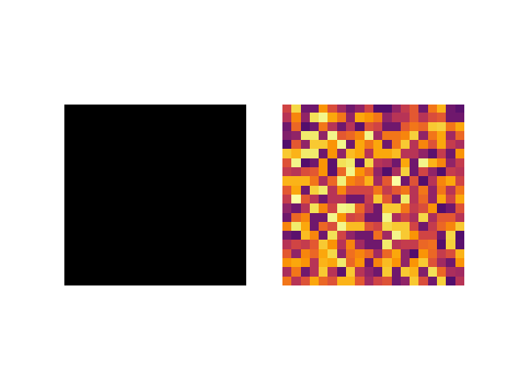
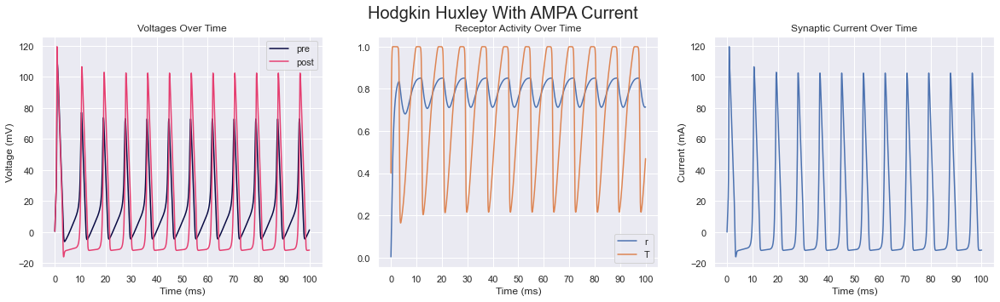
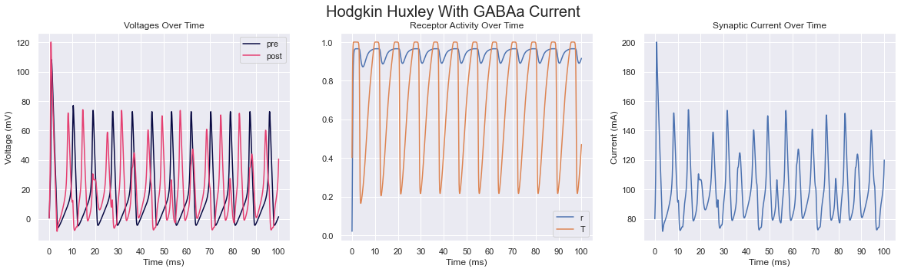
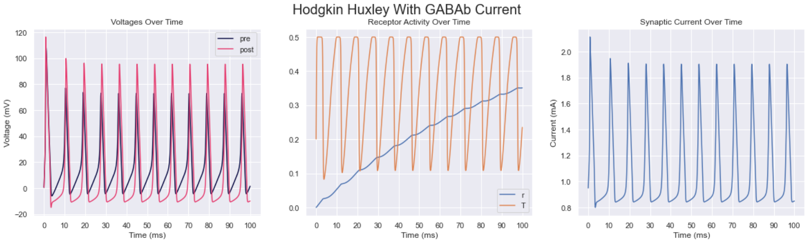
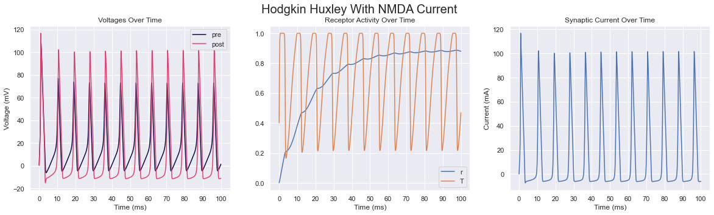
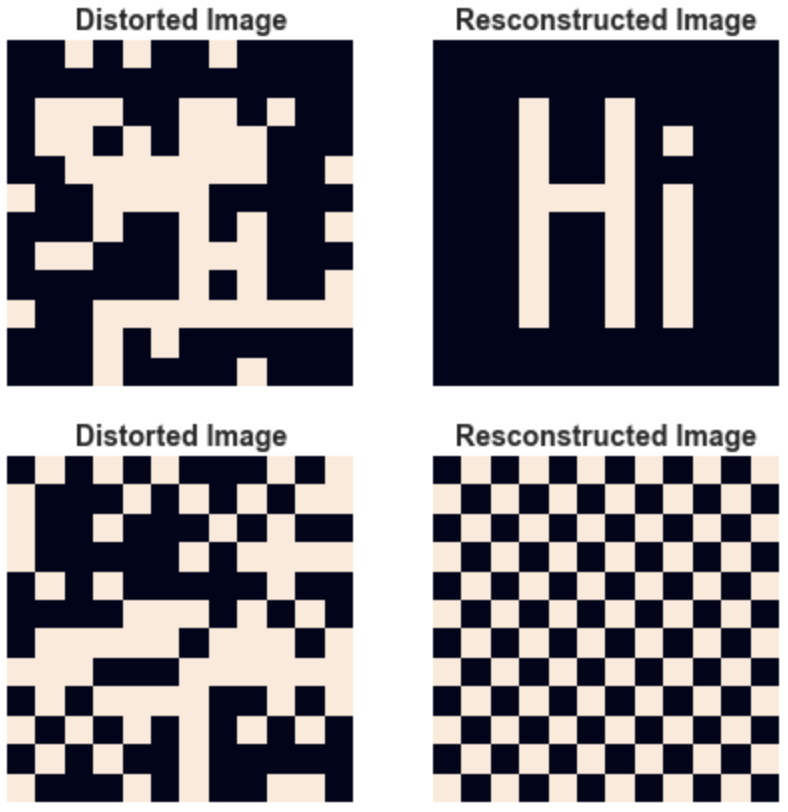

# Spiking Neural Networks

Generalized spiking neural network system with various intergrate and fire models as well as Hodgkin Huxley models,
EEG processing with fourier transforms, and power spectral density calculations

## Biological Neuron Models Broken Down

- (todo...)
- (explanation of integrate and fire)
- (explanation of izhikevich, show lattice diagram)
- (explaination of hodgkin huxley)
- (explanation of ion channels)
- (explanation of neurotransmission, how hodgkin hux system is adapted for izhikevich, explain why receptor kinetics are fixed)
- (explain hopfield network and attactors, show diagrams)

## Todo Notes

- **Redo obsidian notes with new code**

- Obsidian notes on STDP equations
- Update code in obsidian when refactor is done, maybe update results

- Change `BufWriter` capacity from 8 kb to 4 mb or 8 mb and see if its faster (use `with_capacity` function)

- **Integrate and fire split**
  - Write code changes in obsidian

- **Lixirnet should expose EEG processing tools**

- **R-STDP**
  - Reward calculation
  - Dopamine calculation
  - Reward function is passed to `run_lattice`/`run_lattices` method to calculate weight changes
  - Reward modulated lattice and reward modulated network (connecting graph has weights that are an enum, one is reward modulated and has a trace while the other is not), should have option to add non reward modulated lattices
  - Reward optimizer structure, takes in a reward modulated network and a reward function and a state structure and optimizes reward given the state structure, state structure encapsulates state of network (firing rate of readout for example) as well as a state representing something the network is interacting with, also needs a function that given parameters sets the state of network (for instance doing rate encoding on poisson lattice) based on the current state of the environment or the function the network is interacting with and trying to optimize
    - Maybe function optimized by rstdp contains a state within the closure that is mutated

- Astrocytes

- EEG testing
  - Determine frequency band of EEG values over 30 seconds (could calculate frequencies seperately in Python with Numpy for now)
  - Leave room for convergence (about 500 steps with $dt=0.1$)
    - Should expect beta or gamma frequencies above 10 hz and below 50 hz

- `IterateAndSpikeCUDA` trait, could be implemented for electrical synapses only to start out
  - Maybe use WGPU instead

### Classifier/Regression Model Notes

- Potential refactor of STDP to a plasticity trait that, given the last time of firing for two neurons and the current timestep, calculates weight change
  - Plasticity refactor should have boolean method that checks if to apply weight update instead of only doing it on whether neuron is spiking
    - Could have `.update_weight(&self, other_neuron: T) -> f32` instead of a seperate `update_weight` function
    - Could have similar system instead of gap junction
  - Plasticity could require ::update_weight as associated method, lattice takes in update_weight, args are iterateandspike type + spike train type in lattice field or just the plasticity type, in trait args are associated type N, default method uses that associated method, or could use .update_weight(presynaptic)
  - Neuron model lang should have to option to make kinetics and plasticity a trait or a specific implementation
  - For some connections being plastic and some others not being plastic, this could be checked in update weight function or update weight condition, same with some being reward modulated and others not being so
  - Triplet STDP
  - External reward could just be multiplied by change in weight for reward modulated plasticity
  - Plasticity rule called at the end of each `iterate_and_spike`
    - STDP would then check if neuron is spiking and proceed with changing presynaptic and postsynaptic weights
    given the graph and respective lattice
    - Iterate and spike implements a method that takes in a struct (presynaptic neuron) that implements that plasticity trait
    - Plasticity trait has a method that checks if weight should be updated given the neurons and then returns the change in weight, should include different but similar method for spike trains,
    - These methods/traits may need adapting in a graph situation unless plasticity is called when spiking occurs and integrates into current STDP scheme directly by replacing the current `update_weight_stdp` function
  - Could also refactor lattice such that a trait containing a struct with a function to calculate input given an arbitrary neuron that also implements that trait
    - Basically generalizing `gap_junction` functionality
    - Refactor could be a lattice that implements `IterateAndSpike` but also requires another trait detailing the dynamics of the new gap junction

- **For now only run electrical only for classifiers and initial models**

- [Biologically plausible STDP based classifier](https://www.frontiersin.org/articles/10.3389/fncom.2015.00099/full)
  - Only STDP is used
  - Output is dictated as neuron that has the highest firing rate when data is presented
  - After the rates are measured the neurons are assigned a class label
  - [Code example](https://github.com/libgirlenterprise/WheatNNLeek/tree/master)
  - [Kaggle example](https://www.kaggle.com/code/dlarionov/mnist-spiking-neural-network)
  - Poisson neurons repreesent state of each pixel, Poisson neurons are connected to all of the neurons in the excitatory lattice,
  all excitatory neurons are connected to each other but not itself (no self edges), excitatory neurons are each connected to one corresponding inhibitory neuron each, inhibitory neurons are each connected to all other excitatory neurons except their corresponding input excitatory neuron
  - Regular neuron parameters may have to be tuned to get neuron to fire frequently in a 500 ms timespan
  - Poisson neurons are active for 350 ms, which is followed by a 150 ms resting period
    - **$\tau_m$ and $c_m$ may need to be set such that spiking occurs frequently**
  - Firing rate determined by measuring number of spikes, which could be stored in history, history could be a hashmap of positions and a counter, counter is reset for each neuron after prediction, since state is stored as a single value that is pre-allocated the performance should be okay
  - Cell grid voltages should be set within a range between the average minimum voltage and average maximum voltage after converging (averages determined by iterating network without any Poisson input), same with adaptive values
  - Could reduce timestep from `0.1` to `0.2` or `0.5` to decrease simulation time
  - If performance is still an issue after using Rayon then try using WGPU with a compute shader or trying to remove allocations in as many areas as possible or pre allocate necessary space and mutate as simulation progresses
    - May want to phase out optional receptor kinetics with neurotransmitters, neurotransmitters should maybe always have an effect on receptors and makes option stuff cleaner, simpler coupling tests should have option to not use neurotransmitters (instead of receptor kinetics bool)

- Liquid state machine or attractor based classifier using a similar principle to model above using only STDP
  - Could start with MNIST
  - [potential size of liquid](https://www.mdpi.com/2227-7390/10/11/1844)
    - Liquid should have both inhibitory neurons and excitatory neurons
  - Readout layer could be selected based on which neurons have the highest rate of firing when presented with a cue or randomly selected neurons, readout could also potentially be layered
  - If readout layer is using a set of predetermined neurons, then output of readout layer could have the firing rate of each neuron measured and associated with a given class label similar to the unsupervised STDP classifier above

- Attractor based classifier

- R-STDP
  - Dopamine may need longer decay to ensure that weights change afterwards (need to attune $\tau_c$ as well)
  - Lattices implementation
  - Classifier
  - Regression
  - Exploratory period may be necessary
  - Agent could be trained on simpler version of problem and then work its way up to desired problem

- R-STDP based liquid state machine classifier/regression
  - Regression could be predicting a system differential equations representing some physics or some strange attractor
  - Liquid + attractors
    - Test performance of different attractor and combinations of liquids and attractors
  - Testing performance of different number of liquids and different connectivity between liquids effect

### Biological Models Notes

- Hopfield network
  - [Hopfield network pseudocode](https://www.geeksforgeeks.org/hopfield-neural-network/)
  - [Hopfield network tutorial](https://github.com/ImagineOrange/Hopfield-Network/blob/main/hopfield_MNIST.py)
  - [Hopfield network explained](https://towardsdatascience.com/hopfield-networks-neural-memory-machines-4c94be821073)
  - Hopfield network needs its own graph representation, should extend graph trait, some of graph trait could be split up so graph used in lattice simulation has functionality for STDP weights while Hopfield static weights don't change, graph trait could also be refactored so min, max, mean, and std can be passed in rather than STDP parameters
  - **Hopfield spiking neural network prototype**
    - Spiking hopfield should measure how long pattern remains after cue is removed in response in to poissonian noise and how easily it transitions from stable state to stable state, longer it stays in a certain state in response to noise indicates more stability, harder to transition indicates more stability
  - May need to optimize gap conductance values

- Attractor models general attractor models
  - May need to optimize gap conductance values
  - Potentially looking at attractor based classifiers in similar fashion to izhikevich + astrocyte model before moving to liquid state machine + attractor in similar
  - Trainable attractor network model is likely a good model to look at replicating through (potentially unsupervised) hebbian dynamics
- Track when stable states occur
- [Ring attractor in julia](https://github.com/wl17443/ring-attractor/blob/master/src/ring-attractor.jl)
  - Should try modeling head direction cells as a ring attractor (see [https://www.ncbi.nlm.nih.gov/pmc/articles/PMC5613981/]), could use gaussian function to get weights where x is the postynaptic neuron's index and b is the presynaptic, a global inhibition term could be added to the weight (minus k), should also test it without a global inhibitory constant subtraction
    - Gaussian function: $f(x) = ae^\frac{-(i-j)^2}{2c^2} - k$, $i$ is index of presynaptic neuron, $j$ is index of postsynaptic neuron
  - Weights may need some degree of asymmetry to work properly
  - Weights may or may not necessarily need inhibitory connections ($k$ may or may not be necessary)
    - `Nearby cells are connected by strong excitatory synapses, with the strength of excitation proportional to the angular distance between the cells on the ring. Cells that are far apart on the ring are connected with inhibitory synapses. If the strength of excitation and inhibition is appropriately tuned, such an architecture exhibits attractor dynamics.`
  - [Relevant model](https://isn.ucsd.edu/courses/beng260/2019/reports/Yao_Du_Ring_Attractor_Project_Report.pdf)
  - [Another relevant model](https://www.princeton.edu/~adame/papers/coupled-attractor/coupled-attractor)
  - Head direction cells should likely receive input based on rotational velocity, input would then only be necessary when changes in position occur
  - Angular velocity should be translated into either a direct increase in input current or an increase in spikes, that should be given as input to ring attractor
  - Three ring head attractor could be seperated out into layers that are excitatory and inhbitory to comply with Dale's principle
  - [Graph eigenvalues](https://youtu.be/uTUVhsxdGS8?si=1QYUdWrongUZnh-P)
- Could also try a similar mechanism but expanded for (hexagonal and toroidial) grid cells (axial coordinates) (again based on some kind of velocity input) or with place cells/fields
- **Test effect of neurotransmitter on stability of attractor**
  - Neurotransmitters may have to be tweaked to achieve accurate results
  - **Discrete spike neurotransmitter + exponential decay receptor** may be more accurate, will need testing, could also try approximate neurotransmitter + approximate receptor
- Effect of different receptors on learning patterns through STDP could be tested (ie effect of dopamine and serotonin)
- Investigate astrocyte effect on attractors

- Simple recurrent coupled neurons (a -> b -> c -> a), test how excitatory/inhibitory input at a single neuron effects the system
  - Try to create a system where input eventually fades away after input is no longer being applied (fading memory)
  - Can decay gap conductance over time after a spike until a small enough value is reached or another spike occurs
    - **Intrinsic bursting Izhikevich neurons display spike adaption**, should investigate if they will eventually start bursting behavior again after adaptation (could test this by providing static for a period of time until adaptation occurs, removing input for a period of time, and then injecting input again, woud be useful to plot voltages and adaptive values over time)
  - Could use STDP to see if that slowly eliminates input over time
- [Cue model](https://onlinelibrary.wiley.com/doi/full/10.1111/tops.12247#:~:text=Guanfacine%20increases%20(Yohimbine%20decreases)%20the,effect%20on%20nonpreferred%20direction%20neurons.)
  - Cue input is fed into working memory neurons
    - Cue is -1 or 1
  - Working memory neurons loop back into themselves with some bayesian noise
  - Cue is removed and working memory output can be decoded
    - Decoded by taking weighted sum of working memory neurons
    - If below 0, then percieved cue is -1, if above 0, percieved cue is 1
    - **Or perceived cue could be above or below a given baseline, cue itself can be a fast (or excitatory) spike train or a slow (or potentially inhibitory) spike train, 0 is a baseline spike train speed (spike train just being a series of spikes)**
      - Poisson neuron should be used to generate spike train
      - Might be more practical to use an excitatory and inhibitory input and check deviation from baseline over time
  - Firing rate of neurons increase over time signal should become more unstable over time and starts to not represent the same signal
  - To also model forgetting, increasing amounts of noise can be added to working memory model over time

- When done with cue models, move to [liquid state machines](https://medium.com/@noraveshfarshad/reservoir-computing-model-of-prefrontal-cortex-4cf0629a8eff#:~:text=In%20a%20reservoir%20computing%20model,as%20visual%20or%20auditory%20cues.) ([also accessible here](https://journals.plos.org/ploscompbiol/article?id=10.1371/journal.pcbi.1006624))
  - Liquid state machine with discrete neuron reservoir then spiking reservoir
  - Creating a stable liquid
    - Should have some consistent methodology to generate a stable liquid (eigenvalue of each weight vector being within unit circle, or rate of decay being within unit circle, try with 80-20 excitatory to inhibitory neuron ratio and then a more equal one), stability should be measured in whether neurons return to a resting firing rate, for simpler classifiers output may not need to feed back into liquid while reinforcement learning tasks may
  - Recurrent connections in reservoir compute act as working memory that stores information through recurrent connections that may slowly degrade over time, target is slowing the degradation in order to improve memory recall
  - Decoding unit acts as readout, decoding unit likely would need some training in the form of R-STDP
  - Can check accuracy of liquid state machine or stability of answer over time, similar to simple reccurent model
  - Can also check for time until convergence as a measure of learning
  - Can also check the stability of liquid as metric
  - Could also check EEG to see if processing is similar to focused brain activity
  - Model of memory using reservoir compute and R-STDP could model effects of dopamine by modulating relevant R-STDP parameters and modulating the neuron parameters as well, could also model effects of drugs by training first and the messing with modulated values

- When done with basic principles of liquid state machine, attempt general classification tasks with liquid state machines
  - Implementations of liquid state machines and reservoir computing ([Matlab](https://github.com/dmeoli/ComputationalNeuroscience), [Brian2](https://github.com/ricardodeazambuja/SNN-Experiments/blob/master/Implementing%20a%20Liquid%20State%20Machine%20using%20Brian%20Simulator/Implementing%20a%20Liquid%20State%20Machine%20using%20Brian%20Simulator.ipynb))
- Liquid state machine + stable attractor
  - Stable attractor connected to reservoir with feedback (going into attractor could be trainable wheras back into liquid is not)
  - Attractor may need to have a stable state that is just all low states
  - Liquid state machine + discrete attractor, frequency from input neuron is measured over time a high freq means an active state while low freq means inactive, discrete neuron could correspond to a poisson neuron or something similar
    - Liquid state machine + discrete attractor should have the discrete attractor randomly flip input sign for noise
  - Liquid state machine + spiking attractor
  - Testing classifiers and regression models with liquid and attractor model, maybe try multiple attractors
  - Liquid state machine + different kinds of attractors, point/cyclic/sheet/etc attractor
    - Benchmarking the different classifers, (liquid state machine, liquid state machine with n liquids, liquid state machine + x attractor, liquid state machine + n attractors, etc)
  - Could try this with reinforcement learning models

- Model of cognition
  - Cognition modeled in the form of a navigation task
  - Two phases: liquid without additional attractors and liquid state machine with additional attractors
    - Initial navigation system could be a simple liquid state machine with no head direction cells or grid cells attractors
      - Inputs could be what is ahead and distance/direction from target as well as direct obstacles (distance to any walls up ahead)
  - Use head direction attractor and grid cell attractor as input to a liquid reservoir in a liquid state machine, attempt to solve navigation task using this combination of liquid mechanics and attractor mechanics
  - Eventually expand this to a more general system where attractor forms patterns based on internals of liquid through STDP on sections of the liquid, this should allow for more long term memory storage or conceptual representations
    - Attractor would take input from the liquid and output back to the liquid
    - Multiple attractors could be used (likely point attractors)
    - Should test for stability after training by running model and probing attractors
  - Could test recurrence in liquid state machine's readout layer to model further aspects of the brain
    - Test effect of backwards and forward connectivity, increasing backward connectivity could be mechanism of hallucination

- Modeling hallucinations
  - Testing of effect of noise in liquid state machine or Hopfield network and convergence, testing of pruning neuronal connections on convergence
  - Hallucinations are mischaracterization of sensory stimuli (generally the absence of stimuli being mischaracterized as present stimuli) (may need visual or auditory/speech model for lsm) while memory issues are misrecall over time (temporal mischaracterization)
    - (could train model on whether word is detected or not, test what it detects on absence of words and then induce hallucinations conditions)
  - Noise could either be direct bayesian modulation of input or input noise from surrounding poisson neurons (latter may be more accurate)
  - Testing how different converging states are from one another, seeing how different signal to noise ratio is
  - Small world architecture in liquid state machine (various interconnected hubs, ie different connected liquids or stable attractors) effect of cutting off hubs and increasing path size between hubs or decreasing connectivity between hubs in other ways
  - Liquid state machine could be used to test this as well as spiking Hopfield networks, ideally a liquid state machine with explicit working memory in the form of some connected stable attractor
    - Liquid state machine could either be used to classify a given stimulus (visual or auditory)
    - Hallicunation could be considered when absence of stimuli generate readouts that say there exists auditory stimuli
    - Could also be considered a general misclassification
    - Could also have a liquid state machine generate a grid pattern on readout given an input similar to a Hopfield network

- Models of hallucinations and memory may need different neuro chemical dynamics, hallucination may need to have a reduction in just GABA whereas memory may need a reduction in NMDA, should test treatment strategy on both models
  - May need to simulate various combinations of different receptor efficacies to find which one best matches schizophrenia
  - Then looking at treatment simulation, or look at hippocampus or other regions of the brain and try to replicate their receptor statistics

- Eventually try liquid state machine management task

- [Gap junction equation and various models for different currents](https://www.maths.nottingham.ac.uk/plp/pmzsc/cnn/CNN4.pdf)

- Look into delta rule for learning
- [Implementation details of a Izhikevich R-STDP synapse](https://link.springer.com/article/10.1007/s00521-022-07220-6)

### Notes on what to modulate

- Synaptic condutance of ion channels (potentially rate/gating constants)
  - Na+, K+
  - Leak current
  - Ca++ (L-current HVA, T-current)
  - M-current
  - Rectifying channels
- Synaptic conductance of ligand gated channels (potentially maximal neurotransmitter concentration) (and forward and backward rate constants, clearance constant too)
  - AMPA, GABA(a/b), NMDA
  - Glutamate transporter inhibition (by modulation of clearance constant) (potential for antipsychotic properties)
- Metabotropic neurotransmitters (concentration)
  - Dopamine
  - Serotonin
  - Nitric oxide (potential for study of autism)
  - Acetylcholine
  - Glutamate
  - Adrenaline
- Astrocytes
- Weights
  - Weights between certain neurons or specific projections (pyramidal or chandelier for example)

(simulation total time should be around 10 min)

## Todo

### Backend

- [x] Integrate and fire models
  - [x] Basic
  - [x] Adaptive
  - [x] Adaptive Exponential
  - [x] Izhikevich
  - [x] Izhikevich Leaky Hybrid
- [x] Static input test
- [x] STDP test
  - [x] Single coupled neurons
  - [x] Multiple coupled neurons
  - [x] Single coupled R-STDP
    - Note: input spike train is being inputted into input layers, depending on how strongly the output neurons are firing (and which neurons are spiking) reward is applied, this input is being inputted for specific duration *it is not instantaneous*
  - [x] Multiple coupled R-STDP
- [x] Lattice
  - [x] Graph representation of lattice
    - [x] Adjacency list
    - [x] Adjacency matrix
  - [x] Generating GIFs from lattice
    - [x] Naive approach
    - [x] Optimized GIF generation
  - [x] Different potentiation types
    - [x] Inhibitory
    - [x] Excitatory
  - [x] Recording lattice over time
    - [x] Textual
      - [x] Averaged
      - [x] Grid
      - [x] EEG
    - [x] Binary
      - [x] Averaged
      - [x] Grid
  - [x] Lattice testing without STDP
  - [x] Lattice testing with STDP
  - [ ] Lattice with EEG evaluation
    - [x] Analysis with Fourier transforms
      - [x] Calculation of spectral analysis
      - [x] Calculation of Earth moving distance
    - [ ] Option to rewrite Fourier analysis to file
  - [ ] Function that can simulate more than one lattice that have different parameters but are connected by neurons (for instance one lattice can have plasticity while the other does not)
- [ ] Hodgkin Huxley
  - [x] Basic gating
  - [ ] Neurotransmission
    - [x] Systemized method for adding ionotropic neurotransmitters
    - [x] AMPA
    - [x] NMDA
    - [ ] GABA
      - [x] GABAa
      - [ ] GABAb
        - [x] GABAb primary
        - [ ] GABAb secondary
  - [x] Additional gating
  - [ ] More complex neurotransmission equations (with delay time constants and such)
  - [ ] Multicompartmental models
    - [ ] [Cable theory](https://boulderschool.yale.edu/sites/default/files/files/DayanAbbott.pdf)
    - [ ] Systemized method for adding compartments
  - [ ] Hodgkin Huxley iterate and spike functionality
    - Should implement a trait shared with integrate and fire neuron that iterates the state of the neuron and returns whether it is spiking
    - Should be implemented for coupling test, STDP, and lattice simulation
    - Hodgkin Huxley lattice function should share as much code as possible with integrate and fire function
- [x] Neurotransmitter refactor
- [x] Poisson neuron
  - [x] Coupling
    - [x] Potentiation type
- [x] Spike train struct
- [ ] Parsing of `.nb` file into model
  - [x] Ion channels
  - [x] Neuron model
  - [x] Basic functions
  - [x] Ligand gates
  - [x] Parameterizable neurotransmitter type
  - [ ] Plasticity
- [ ] BCM rule
  - [ ] Reward modulated BCM
- [ ] Astrocytes model
  - [Coupled with Hodgkin Huxley neurons](https://www.ncbi.nlm.nih.gov/pmc/articles/PMC3843665/)
  - [Astrocytes equations](https://www.sciencedirect.com/science/article/pii/S0960077922011481)
  - [Astrocytes + Izhikevich](https://www.frontiersin.org/articles/10.3389/fncel.2021.631485/full)
    - [Code for astrocytes and neural network](https://github.com/altergot/neuro-astro-network)
    - Astrocyte should respond to total glutamate levels of modulated synapses, glutamate input should only have an effect for $t$ steps after the coherence threshold is met
  - [ ] Tripartite synapse
    - Record how weights change over time
    - Isolated tripartite synapse should not include diffusion from other astrocytes
  - [ ] Neuro-astrocytic network (hippocampal model)
    - Could be tested with or without STDP occuring
    - Record how weights change over time
- [ ] Simulating modulation of other neurotransmitters on lattice
- [ ] Simulation of working memory (refer to guanfacine working memory model)
  - [x] Discrete state neuron
  - [x] Discrete learning rules
  - [x] Hopfield network
  - [ ] Liquid state machine
    - Should have a cue and retrieval system (for now supervised, could look into unsupervised methods later)
      - Present cue for duration, remove cue, see how long retrieval signal lasts
        - Matching task, present cue, remove cue, present a new cue and determine whether the new cue is the same or different (DMS task)
      - Could add noise over time similar to simple recurrent memory to modulate forgetting if signal stability stays constant
      - **Measure signal stability after cue is removed (see guanfacine paper)**
      - Measure ability to complete task, time taken to converge, and potentially liquid stability
    - Could model cognition with something similar to a traveling salesman problem
  - [ ] Liquid state machine with astrocytes
  - [ ] Neuro-astrocyte memory model
- [ ] Simulation of psychiatric illness
- [ ] Simulation of virtual medications
- [ ] R-STDP based classifier
  - Reward may need to be applied after a grace period so the model can converge on an answer first
  - [ ] Simple encoding of input
  - [ ] Modifying the bursting parameters to encode more information in input
    - [ ] Potentially having weights directly calculated/modified from bursting parameters
  - [ ] Liquid state machine with R-STDP
    - Could look into weighted graphs input, each node could a place on a prism geometry and each weight could be a node in between each node, could also be rotated in the geometry for data augmentation purposes
    - Or could input as an adjacency matrix (SMILES enumeration compatible)
  - [ ] Liquid state machine with astrocytes and R-STDP
  - [ ] Combining input with neurotransmission, encoding certain inputs with more or less neurotransmitter (ionotropic or otherwise)
- [ ] R-STDP based regression
  - Number of spikes in an interval or distance between spikes could act as regression value
    - Additionally multiple outputs from different neurons in the output layer could be summed for a single regression value (for example one neuron could represnt 0-9, another could be 0, 10, 20, ..., 90 and summed together for the full number)
  - [ ] Liquid state machine fitting differential equation or time series
    - Potentially physics prediction, parameters of physics simulation could be inputs along with current position, next position could be target to predict
    - Similarly, a Lorenz attractor could be predicted by a liquid state machine
- [ ] Liquid state machine solving of more general cognition problem  
  - [ ] Traveling salesman
  - [ ] Maze solve/navigation to reward
  - Could model general cognition with similar test case and the effect of different neurotransmitters on the efficacy of the solve
  
### Lixirnet

- [x] Integrate and fire models
  - [x] Basic
  - [x] Adaptive
  - [x] Adaptive Exponential
  - [x] Izhikevich
  - [x] Izhikevich Leaky Hybrid
- [x] Hodgkin Huxley
  - [x] Basic gating
  - [x] Neurotransmission
- [x] Static input test
- [ ] Plasticity
  - [x] Regular STDP
  - [ ] R-STDP
  - [ ] BCM
  - [ ] R-BCM
- [ ] Lattice
  - [ ] Graphs input
    - [ ] Adjacency list
    - [x] Adjacency matrix
- [ ] Parsing of `.nb` file into neuron model

<!-- ## Results

### Lattice

### Hodgkin Huxley

#### Neurotransmission

#### Hopfield Reconstruction

 -->

## Sources

- (todo)
- izhikevich
- destexhe
- antipsychotics sim paper
- dopamine model with hodgkin huxley
- biological signal processing richard b wells
