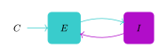

# README

## Todo

- [x] Simulation pipeline for simulating a presentation of a cue and state transitioning
- [x] Varying ionotropic neurotransmitters
  - [x] Glutamate clearance
  - [x] GABA clearance
  - [ ] NMDA/AMPA clearance
  - [ ] NMDA, AMPA, GABAa $g_max$
- [ ] $D_1$ and $D_2$ model implementation for gain modulation on NMDA and AMPA
  - [ ] Method to vary effect of dopamine concentration (probably through NMDA and AMPA modifier)
- [ ] Bayesian inference with no gain modulation
  - [ ] Emotional cue modulates selection of memory
  - [ ] Existing memory modulates selection of memory
  - [ ] Could vary ionotropic neurotransmitters
    - Should see changes in accuracy
- [ ] Bayesian inference with gain modulation
  - [ ] Emotional cue modulates select of memory with dopamine mechanism
  - [ ] Existing memory modulates selection of memory with dopamine mechanism
  - [ ] Vary dopamine modulation and ionotropic neurotransmitter dynamics
- [ ] Small world simulation
  - [ ] Simulating multiple memories biasing each other with no dopamine modulation
  - [ ] Simulating multiple memories biasing each other with dopamine modulation
  - [ ] Vary dopamine modulation and ionotropic neurotransmitter dynamics
- [ ] Liquid state machine
  - [ ] Basic liquid dynamics
  - [ ] STDP based learning of MNIST
  - [ ] Varying ionotropic neurotransmitters
    - [ ] Glutamate clearance
    - [ ] GABA clearance
    - [ ] NMDA/AMPA clearance
    - [ ] NMDA, AMPA, GABAa $g_{max}$
    - [ ] $D_1$ and $D_2$
      - [ ] Dopamine clearance
      - [ ] Dopamine modifier for AMPA
      - [ ] Dopamine modifier for NMDA
  - [ ] Small world simulation where liquid and memory interact
- [ ] Repeat experiments with more detailed ion channel models and vary ion channel conductances
  - [ ] Could also vary $Mg^{2+}$

## Schizophrenia Simulation Pipeline

The pipeline simulates brain activity by generating two groups of neurons, one inhibitory group
and one excitatory group. The excitatory group acts as an autoassocative network that has been set
to remember a set amount of randomly generated patterns. The inhibitory group is connected to the excitatory group in a one to all fashion, while the excitatory group is connected to the inhibitory
group randomly. There is a spike train lattice that drives the inputs of the network into the excitatory
group. During the simulation, a cue can be presented in the first phase and optionally the second phase,
the cues can also either be a pattern cue with some distortion or a random noisy cue to act as a distractor.
If the cue is enabled in both the first and second phase, the pattern will be different for each cue.
The variables of the simulation, the neurotransmitter decay or clearance values, the conductances of the ionotropic channels, or the weights themselves, can be varied for a set amount of trials. Presenting a cue with high inhibition may lead to the total activity of the network decaying over time to zero, resulting in the state not being maintained. Low inhibition with no cue may result in spontaneous activity lacking an input, which can simulate hallucination.



Cue ($C$) feeds input into excitatory group ($E$) using glutamate (blue), excitatory group feeds into inhibitory group ($I$) using glutamate,
inhibitory group feeds back into excitatory group using GABA (purple).

### Schizophrenia Simulation `[simulation_parameters]`

---

### Schizophrenia Simulation Required Fields

| Field        | Type    | Description                                    |
|--------------|---------|------------------------------------------------|
| `filename`   | string  | Path to the file where results will be saved. |

### Schizophrenia Simulation Optional Fields

The following fields have default values if not specified in the TOML file:

| Field                          | Type    | Default Value      | Description                                                   |
|--------------------------------|---------|--------------------|---------------------------------------------------------------|
| `iterations1`                  | integer | 3000               | Number of iterations for the first phase of the simulation  |
| `iterations2`                  | integer | 3000               | Number of iterations for the second phase of the simulation |
| `peaks_on`                     | boolean | false              | Whether to write peaks to the output                        |
| `cue_firing_rate`              | float   | 0.01               | Baseline firing rate for the cue spike trains               |
| `second_cue`                   | boolean | true               | Whether a second cue is present                             |
| `second_cue_is_noisy`          | boolean | false              | Whether the second cue is noisy                             |
| `first_cue_is_noisy`           | boolean | false              | Whether the first cue is noisy                              |
| `noisy_cue_noise_level`        | float   | 0.1                | Noise level for noisy cues                                  |
| `noisy_cue_firing_rate`        | float   | 0.01               | Firing rate for noisy cues                                  |
| `measure_snr`                  | boolean | false              | Whether to measure the signal-to-noise ratio                |
| `first_window`                 | integer | 1000               | Accuracy calculation window size for the first phase        |
| `second_window`                | integer | 1000               | Accuracy calculation window size for the second phase       |
| `trials`                       | integer | 10                 | Number of trials to run in the simulation                   |
| `num_patterns`                 | integer | 3                  | Number of patterns to simulate (excitatory weights divided by this number) |
| `weights_scalar`               | float   | 1                  | Scaling factor for excitatory weights                       |
| `inh_weights_scalar`           | float   | 0.25               | Scaling factor for inhibitory weights                       |
| `a`                            | float   | 1                  | Autoassociative network pattern calculation variable, $\frac{s}{n}\sum_{i}\sum_{j}(\xi^{u}_{i}-b)(\xi^{u}_{j}-a)$                          |
| `b`                            | float   | 1                  | Autoassociative network pattern calculation variable, $\frac{s}{n}\sum_{i}\sum_{j}(\xi^{u}_{i}-b)(\xi^{u}_{j}-a)$                          |
| `correlation_threshold`        | float   | 0.08               | Threshold for considering patterns as correlated too correlated (will generate new better if threshold crossed)           |
| `use_correlation_as_accuracy`  | boolean | false              | Use correlation as a measure of accuracy (true if maxiamlly correlated pattern is inputed pattern)                 |
| `get_all_accuracies`           | boolean | false              | Whether to write all accuracies to output                   |
| `skew`                         | float   | 1                  | Skew parameter for distribution of initial voltage values   |
| `exc_n`                        | integer | 7                  | Number of excitatory neurons                                |
| `inh_n`                        | integer | 3                  | Number of inhibitory neurons.                               |
| `distortion`                   | float   | 0.15               | Amount of distortion in the patterns presented              |
| `dt`                           | float   | 1                  | Time step of the simulation                                 |
| `c_m`                          | float   | 25                 | Membrane capacitance                                        |

---

### Schizophrenia Simulation `[variables]`

---

### Schizophrenia Simulation Variable Fields

The following variables will be combined in every possible way, for how ever many specified trials,
simulation parameters will hold constant while these states change

| Field                     | Type    | Default Value | Description                                                |
|---------------------------|---------|---------------|------------------------------------------------------------|
| `prob_of_exc_to_inh`      | array[float]   | `[0.5]`       | Probability of excitatory-to-inhibitory connections       |
| `exc_to_inh`              | array[float]   | `[1]`         | Strength of excitatory-to-inhibitory connections        |
| `spike_train_to_exc`      | array[float]   | `[5]`         | Spike train values for excitatory neurons                |
| `nmda_g`                  | array[float]   | `[0.6]`       | Conductance for NMDA receptors                           |
| `ampa_g`                  | array[float]   | `[1]`         | Conductance for AMPA receptors                           |
| `gabaa_g`                 | array[float]   | `[1.2]`       | Conductance for GABAa receptors                          |
| `nmda_clearance`          | array[float]   | `[0.001]`     | Clearance rate for NMDA neurotransmitters                |
| `ampa_clearance`          | array[float]   | `[0.001]`     | Clearance rate for AMPA neurotransmitters                |
| `gabaa_clearance`         | array[float]   | `[0.001]`     | Clearance rate for GABAa neurotransmitters               |

If the `glutamate_clearance` field is present, it overrides `nmda_clearance` and `ampa_clearance` with its value,
using `glutamate_clearance` will only iterate through states where the `nmda_clearance` and `ampa_clearance` values are the same,
synchronizing the glutamate clearance values

| Field                 | Type    | Default Value | Description                                                |
|-----------------------|---------|---------------|------------------------------------------------------------|
| `glutamate_clearance` | array[float]   | None          | Single value applied to both NMDA and AMPA clearance rates |

---

### Schizophrenia Simulation Example Argument File

```toml
[simulation_parameters]
peaks_on = true
second_cue = false
second_cue_is_noisy = false
use_correlation_as_accuracy = true
measure_snr = true
weights_scalar = 1
inh_weights_scalar = 0.85
skew = 0.1
c_m = 25
a = -1
b = 0
first_window = 1000
second_window = 3000
iterations1 = 2000
iterations2 = 3000
trials = 15

filename = "grti_with_cue.json"

[variables]
spike_train_to_exc = [5]
prob_of_exc_to_inh = [1]
glutamate_clearance = [0.001, 0.002, 0.003, 0.004, 0.005, 0.006, 0.007, 0.008, 0.009, 0.01]
gabaa_clearance = [0.001]
```

## Bayesian Inference Pipeline

...

### Bayesian Inference `[simulation_parameters]`

### Bayesian Inference Required Fields

### Bayesian Inference Optional Fields

### Bayesian Inference `[variables]`

### Bayesian Inference Variable Fields

### Bayesian Inference Example Argument File
